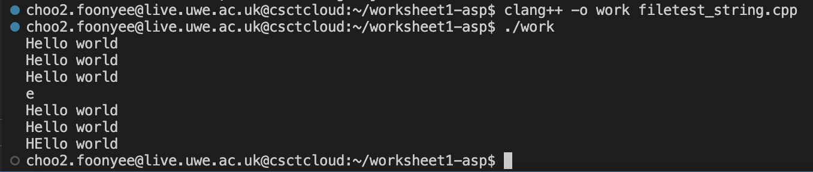
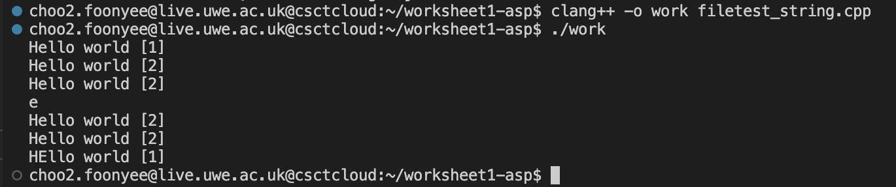
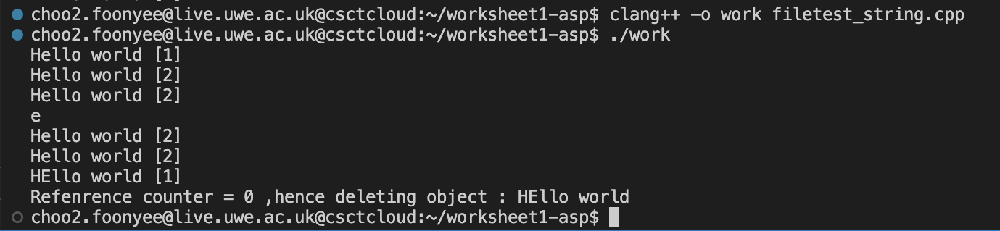
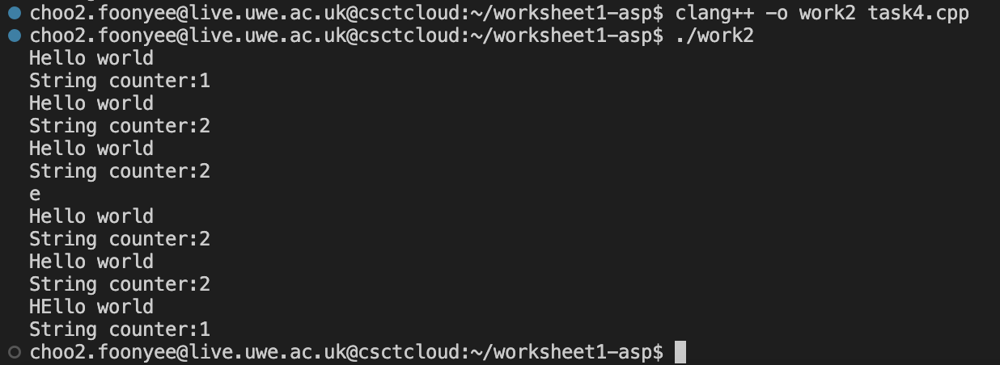

# worksheet1-ASP
Click on the following to the each task:-  
[Task 1](#task-1)<br />
[Task 2](#task-2)<br />
[Task 3](#task-3)<br />
[Task 4](#task-4)<br />

## Task 1
The implementation is compatible with strings of any length, because it employs dynamic memory allocation to create a duplicate of any string data provided in construction or via assignment.  

```
private:
    char * str_; // to allocate dynamic memory for the string
    int * counter;

public:

    my_string(){
    }
```

The output of the following will be "HEllo world" on the last line, because it is set that [1] will change to a uppercase 'e'.

```
#include"my_string.hpp"

int main() {
    my_string s("Hello world");
    s.print(); 
    {
       my_string t = s;
       s.print();
       t.print();
       std::cout << s.getChar(1) << std::endl;
       s.print();
       t.print();
    }
    s.setChar(1,'E');
    s.print();
}
```

The string should not be duplicated by the assignment and copy operations. This is because they ought to have the same underlying memory, so changing one string updates the other.

```
char getChar(const int& i){
        return str_[i]; // retrun string
    }
    const

    void setChar(const int& i, const char& c){
        str_[i] = c;
    }
    void print() {
        std::cout << str_ << " " << "[" <<*counter << "]" << std::endl; //print statement
    }
```
The output of task 1:-


## Task 2

counter is added in this task because it will be use to indicate the string printed. The string implementation is extended to support automatic reference counting. A key element of this is that the interface for my_string did not have any changes but, the destructor ~my_string()free the allocated memory when the reference count is 0. Therefore, it will delete the string when there are no remaining references to the object.

```
my_string(const char* str) {
        str_ = new char[strlen(str) + 1]; // dynamic memory allocation
        strcpy(str_, str);
        counter = new int; // dynamic memory allocation
        *counter = 1;
    }

my_string(my_string const& s) {
        this-> str_ = s.str_; // use "this->" because it refers to the current instance of the class.
        this-> counter=s.counter;
        *counter = *counter + 1; // counter plus one because in string the first character starts from 0
        //Therefore, to make the first character 1, it has to plus 1
    }

    my_string& operator= (my_string const& s){
        if (this == &s)
        {
            return *this; // return counter
        }

        this-> str_ = s.str_;
        this-> counter=s.counter; //to support automatic reference counting
        *counter = *counter + 1; //counter plus one because in string the first character starts from 0
        return *this; // return counter

```

Counter is added one because in string the first character starts from 0. Therefore, to make the first character 1, it has to plus 1.

The output of task 2:-


## Task 3
Extend the example test program to demostrate when the case of a reference count of 0 where it free the allocated memory.
The IF statement is used to allows reference count of 0.

```
~my_string() { // free the allocated memory
        //delete[] str_;
        *counter = *counter-1; 

        if (*counter==0){ // ONLY when the reference count is 0
            std::cout << "Refenrence counter = 0 ,hence deleting object : " << str_ << std::endl; //print demostration for task 3
            delete str_; //it will delete the object, when the case of a reference count is 0
            delete counter; // delete counter, when the case of a reference count is 0
        }
    }
```
When the reference count is 0, it will conduct the IF statement which will delete the object and counter.

The output of task 3:-


## Task 4

#### Point
Before working on string, points were used to test for the referencing counting class.
```
class Point{

    private:
        int x; // create object
        int y;

    public:
        Point(int const& x, int const& y){
            this->x = x; //use "this->" because it refers to the current instance of the class
            this->y = y;
        }

        void display(){
            cout << "X = " << x << ", Y = " << y << endl; // print points

        }
};
```

Test with points:-
```
    //Test with points
    Point p1(5,2);
    p1.display();

    Referencecounter<Point> p1 (new Point(4,3));
    cout << "Point counter:" << p1.get_counter() << endl;

    {Referencecounter<Point> p2 (p1);
    cout << "Point counter:" << p1.get_counter() << endl;
    }
```

#### Template
Template allows us to create a function template whose functionality can be adapted to more than one type or class without repeating the entire code for each type. It will be an object of the same type as the parameters a and b when the function template is instantiated with a specific type.

A template class that handles reference counting:-
```
template <typename T> // template function_declaration
class Referencecounter{

    private:
        T* data;
        int * counter;

    public:
        Referencecounter(): data(), counter(new int (0)){

        }
        Referencecounter(T * data) : data(data), counter(new int (1)){

        }

        Referencecounter(Referencecounter const& obj){
            this-> data = obj.data;
            this-> counter=obj.counter;
            *counter = *counter + 1;
        }

        Referencecounter& operator= (Referencecounter const& obj){

            if (this== &obj){
                return *this;
            }            
            this-> data = obj.data;
            this-> counter=obj.counter;
            *counter = *counter + 1;
            return *this;
        }

        T* operator->(){
            return this->data;
        }

        int get_counter(){
            return *counter;
        }

        ~Referencecounter(){
            *counter = *counter-1;
            if (*counter == 0){
                delete data;
                delete counter;
            }
        }
};
```

The output of task 4:-


